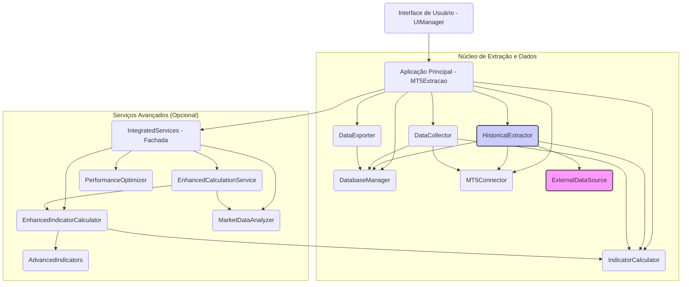
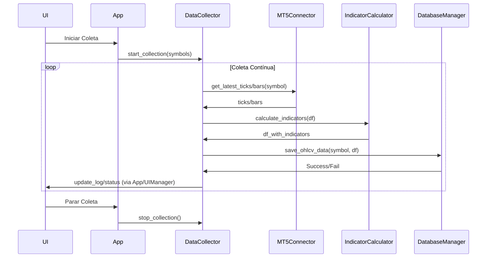

# Arquitetura Avançada de Cálculo e Otimização

Este documento descreve a arquitetura avançada implementada para cálculo de indicadores e otimização de desempenho no sistema MT5 Extração.

## Visão Geral

A arquitetura avançada foi projetada para resolver desafios específicos relacionados ao processamento de grandes volumes de dados de mercado, incluindo:

1. Utilização eficiente de recursos computacionais
2. Processamento paralelo para maior desempenho
3. Gestão de memória inteligente
4. Escalabilidade para diferentes ambientes
5. Resiliência a falhas e exceções

A implementação adota um padrão de arquitetura em camadas, onde cada componente tem responsabilidades bem definidas e se comunica através de interfaces claras.

## Diagrama de Componentes (Visão Geral)



*Componentes em roxo (`ExternalDataSource`) e azul (`HistoricalExtractor`) foram adicionados/modificados recentemente.*

## Componentes Principais

### 1. EnhancedCalculationService

Serviço responsável pelo cálculo de indicadores técnicos, estatísticas avançadas e análises de mercado. Principais características:

- **Processamento assíncrono**: Executa cálculos em threads separadas
- **Cache inteligente**: Armazena resultados intermediários para reutilização
- **Processamento em lotes**: Divide grandes conjuntos de dados em partes menores para processamento
- **Gestão de recursos**: Monitora o uso de CPU e memória, adaptando a execução às condições do sistema

#### Métodos Principais:
- `calculate_indicators_async()`: Agenda cálculos para processamento em segundo plano
- `calculate_indicators_sync()`: Versão síncrona (bloqueante) da função anterior
- `process_large_dataset()`: Processa dataframes grandes dividindo-os em lotes 
- `process_data_batch()`: Processa múltiplos dataframes em paralelo

### 2. PerformanceOptimizer

Componente responsável por monitorar recursos do sistema e otimizar o desempenho. Características:

- **Monitoramento de recursos**: Acompanha uso de CPU, memória e tempos de execução
- **Estratégias adaptativas**: Ajusta parâmetros de processamento com base na carga do sistema
- **Otimização de memória**: Reduz o consumo de memória de DataFrames
- **Cache adaptativo**: Implementa cache que se ajusta à disponibilidade de memória

#### Métodos Principais:
- `optimize_dataframe()`: Otimiza estruturas de dados para menor consumo de memória
- `recommended_batch_size()`: Sugere tamanho ideal de lotes para processamento
- `recommend_parallel_workers()`: Recomenda número ideal de workers para processamento paralelo
- `timeit` (decorador): Mede tempos de execução de funções
- `adaptive_cache` (decorador): Implementa cache que se adapta à carga do sistema

### 3. EnhancedIndicatorCalculator

Classe que centraliza o cálculo de indicadores técnicos, estatísticos e padrões de preço. Características:

- **Indicadores avançados**: Implementa indicadores além dos básicos
- **Análise de padrões de preço**: Identifica padrões de candlestick e formações de preços
- **Estatísticas avançadas**: Calcula métricas estatísticas sobre os dados

#### Métodos Principais:
- `calculate_all_indicators()`: Calcula todos os indicadores configurados
- `calculate_technical_indicators()`: Calcula apenas indicadores técnicos padrão
- `calculate_advanced_indicators()`: Calcula indicadores avançados específicos
- `analyze_price_patterns()`: Identifica padrões nos dados de preço

### 4. MarketDataAnalyzer

Componente para análise contextual do mercado, considerando fatores externos. Características:

- **Identificação de sessões de mercado**: Detecta sessões de negociação (Ásia, Europa, EUA)
- **Análise de eventos econômicos**: Detecta proximidade com eventos econômicos importantes
- **Análise de volatilidade**: Identifica regimes de volatilidade e padrões temporais

#### Métodos Principais:
- `analyze_market_data()`: Adiciona contexto de mercado aos dados de preço
- `identify_market_session()`: Determina a sessão de mercado ativa
- `find_economic_events()`: Localiza eventos econômicos próximos ao timestamp
- `calculate_volatility_regimes()`: Analisa e classifica a volatilidade do mercado

### 5. IntegratedServices

Classe que atua como fachada (Facade) para todos os serviços, simplificando o acesso às funcionalidades. Características:

- **Inicialização coordenada**: Gerencia a criação e configuração de todos os serviços
- **Gestão de recursos**: Inicializa componentes com parâmetros otimizados
- **API simplificada**: Oferece métodos de alto nível para operações comuns

#### Métodos Principais:
- `fetch_market_data()`: Obtém dados do MT5 para um símbolo e timeframe
- `process_data()`: Processa um DataFrame com cálculo de indicadores
- `analyze_symbol()`: Realiza análise completa de um símbolo
- `schedule_data_collection()`: Agenda coleta periódica de dados
- `export_processed_data()`: Exporta dados processados para arquivos

## Fluxos de Dados Principais

### 1. Coleta de Dados em Tempo Real (Ticks/Último Candle)



### 2. Extração de Dados Históricos

```mermaid
sequenceDiagram
   participant UI
   participant App
   participant HistoricalExtractor as HE
   participant MT5Connector as MC
   participant ExternalDataSource as EDS
   participant DatabaseManager as DBM
   participant IndicatorCalculator as IC

   UI->>App: Iniciar Extração Histórica (symbols, period, timeframe, overwrite)
   App->>HE: extract_data(...)
   HE->>HE: Determinar Chunking (dinâmico)
   loop Para cada Símbolo (paralelizado)
       loop Para cada Bloco de Tempo
           HE->>MC: get_historical_data(bloco)
           alt MT5 Falhou e Timeframe=M1 e Fallback Ativo
               HE->>EDS: get_historical_m1_data(bloco)
               alt Fallback OK
                   EDS-->>HE: df_bloco_externo
               else Fallback Falhou
                   EDS-->>HE: None
                   HE-->>App: Registrar Falha Bloco
                   break
               end
           else MT5 OK
                MC-->>HE: df_bloco_mt5
           else MT5 Falhou (sem fallback)
                MC-->>HE: None
                HE-->>App: Registrar Falha Bloco
                break
           end
           opt Bloco Obtido (MT5 ou Fallback)
               HE->>IC: calculate_indicators(df_bloco)
               IC-->>HE: df_bloco_com_indicadores
               HE->>DBM: save_ohlcv_data(symbol, df_bloco_com_indicadores)
               DBM-->>HE: Success/Fail
           end
       end
   end
   HE->>UI: Extração Concluída (via App/UIManager)

```

### 2. Processamento Assíncrono

```
IntegratedServices
       │
       ▼
EnhancedCalculationService
       │
       ├─── Worker Thread 1 ─── EnhancedIndicatorCalculator
       │
       ├─── Worker Thread 2 ─── EnhancedIndicatorCalculator
       │
       └─── Worker Thread n ─── EnhancedIndicatorCalculator
```

## Mecanismos de Otimização

1. **Cache LRU (Least Recently Used)**
   - Armazena resultados de cálculos recentes
   - Remove automaticamente itens menos usados quando necessário
   - Adapta tamanho com base na memória disponível

2. **Otimização de Tipos de Dados**
   - Reduz consumo de memória de DataFrames
   - Utiliza tipos numéricos otimizados (int8, float32, etc.)
   - Converte colunas categóricas para tipo 'category'

3. **Processamento em Lotes**
   - Divide grandes conjuntos de dados em partes menores
   - Tamanho dos lotes ajustado dinamicamente
   - Paralelização por lotes para melhor desempenho

4. **Monitoramento e Adaptação**
   - Acompanha uso de CPU e memória
   - Ajusta parâmetros de processamento
   - Reduz complexidade em situações de alta carga

## Considerações de Implementação

1. **Gerenciamento de Recursos**
   - Workers são iniciados como threads daemon
   - Recursos são liberados adequadamente no encerramento
   - Implementa limpeza periódica de cache e resultados antigos

2. **Tratamento de Erros**
   - Falhas em jobs individuais não afetam outros processamentos
   - Mecanismos de fallback quando serviços avançados não estão disponíveis
   - Logging detalhado para diagnóstico de problemas

3. **Configurabilidade**
   - Parâmetros ajustáveis via arquivo de configuração
   - Seleção de indicadores a calcular
   - Controle sobre uso de recursos
### 6. HistoricalExtractor

Componente dedicado à extração robusta de dados históricos.

- **Busca em Blocos (Chunking)**: Divide grandes períodos em blocos menores para evitar limites da API MT5. O tamanho do bloco é configurável dinamicamente por timeframe via `config.ini`.
- **Retentativas com Backoff**: Tenta buscar novamente um bloco em caso de falha temporária.
- **Paralelização**: Processa múltiplos símbolos em paralelo usando threads.
- **Fallback M1**: Se configurado (`[FALLBACK]` no `config.ini`), tenta buscar dados M1 de uma fonte externa (`ExternalDataSource`) caso a busca via MT5 falhe.
- **Sobrescrita**: Permite opcionalmente deletar dados existentes antes de salvar novos dados históricos.

### 7. ExternalDataSource (Interface)

Interface abstrata (`abc.ABC`) que define o contrato para fontes de dados externas. Qualquer nova fonte (ex: API paga da B3) deve implementar esta interface.

- `is_configured()`: Verifica se a fonte está pronta para uso.
- `get_historical_m1_data()`: Método principal para buscar dados M1.

Atualmente, existe a implementação `DummyExternalSource` para fins de teste.

### 8. DatabaseManager (Atualizações)

- **Schema Completo**: Agora cria tabelas (se não existirem) com um schema predefinido completo, incluindo todas as colunas de indicadores básicos, avançados e variações percentuais. Isso evita erros de "coluna não encontrada" durante a inserção.
- **Nomes de Coluna**: Colunas de variação percentual foram renomeadas de `%_var_...` para `var_pct_...` para maior compatibilidade com SQL.

## Configurações Avançadas (`config/config.ini`)

O arquivo `config/config.ini` permite ajustar comportamentos da extração histórica:

- **`[FALLBACK]`**:
   - `external_source_m1_fallback_enabled`: `True` ou `False` para habilitar o fallback para dados M1.
   - `external_source_m1_type`: Tipo da fonte externa (ex: `Dummy`).
- **`[EXTRACTION]`**:
   - `chunk_days_m1`: Tamanho do bloco (dias) para M1.
   - `chunk_days_m5_m15`: Tamanho do bloco para M5/M15.
   - `chunk_days_default`: Tamanho do bloco para outros timeframes.

## Exemplo de Uso (Extração Histórica via UI)

1.  Abrir o aplicativo (`python app.py`).
2.  Selecionar símbolos na lista "Símbolos Disponíveis".
3.  Adicionar à lista "Símbolos Selecionados".
4.  Selecionar o Timeframe desejado.
5.  Ajustar as datas de Início e Fim.
6.  Marcar/Desmarcar "Calcular Indicadores" e "Sobrescrever Dados".
7.  Clicar em "Iniciar Extração Histórica".
8.  Acompanhar o progresso na área de logs e na barra de progresso.

## Requisitos de Sistema

(Mantido como antes)

## Considerações de Segurança

(Mantido como antes)
- Validação de entradas para prevenir manipulação 