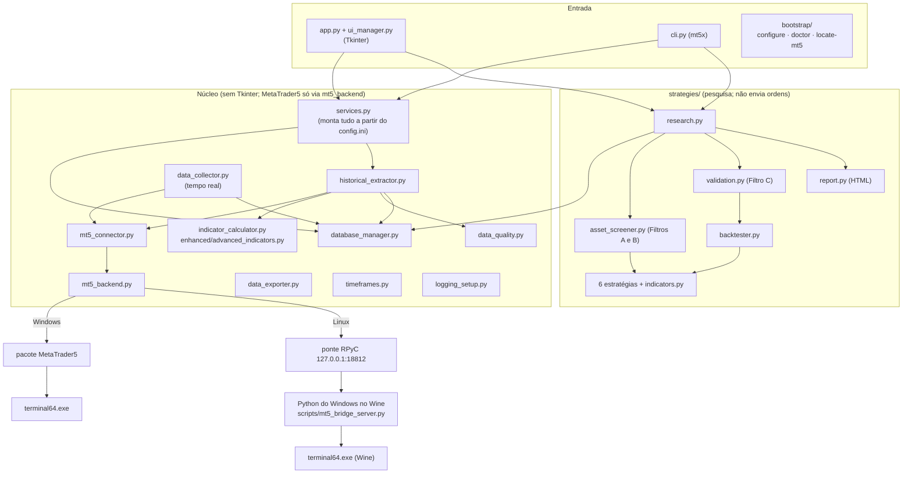

# Arquitetura

Visão do código como ele é hoje (atualize junto com mudanças estruturais). Regras para quem
altera o projeto: [AGENTS.md](../AGENTS.md). Próximos passos: [ROADMAP.md](ROADMAP.md).

## Visão geral

```mermaid
graph TD
    subgraph Entrada
        GUI["app.py + ui_manager.py<br/>(Tkinter)"]
        CLI["cli.py (mt5x)"]
        BOOT["bootstrap/<br/>configure · doctor · locate-mt5"]
    end

    subgraph Núcleo["Núcleo (sem Tkinter; MetaTrader5 só via mt5_backend)"]
        SVC["services.py<br/>(monta tudo a partir do config.ini)"]
        CONN["mt5_connector.py"]
        BACK["mt5_backend.py"]
        HE["historical_extractor.py"]
        DC["data_collector.py<br/>(tempo real)"]
        IC["indicator_calculator.py<br/>enhanced/advanced_indicators.py"]
        DQ["data_quality.py"]
        DB["database_manager.py"]
        EXP["data_exporter.py"]
        TF["timeframes.py"]
        LOG["logging_setup.py"]
    end

    subgraph Estratégias["strategies/ (pesquisa; não envia ordens)"]
        RES["research.py"]
        STR["6 estratégias + indicators.py"]
        BT["backtester.py"]
        VAL["validation.py (Filtro C)"]
        SCR["asset_screener.py (Filtros A e B)"]
        REP["report.py (HTML)"]
    end

    GUI --> SVC
    CLI --> SVC
    SVC --> DB
    SVC --> HE
    HE --> CONN
    HE --> IC
    HE --> DQ
    HE --> DB
    DC --> CONN
    DC --> DB
    CONN --> BACK
    BACK -->|Windows| PKG["pacote MetaTrader5"]
    BACK -->|Linux| BRIDGE["ponte RPyC 127.0.0.1:18812"]
    BRIDGE --> WINE["Python do Windows no Wine<br/>scripts/mt5_bridge_server.py"]
    WINE --> TERM["terminal64.exe (Wine)"]
    PKG --> TERMW["terminal64.exe"]
    GUI --> RES
    CLI --> RES
    RES --> DB
    RES --> SCR
    RES --> VAL
    RES --> REP
    VAL --> BT
    BT --> STR
    SCR --> STR
```

## Camadas

### 1. Instalação e configuração — `mt5_extracao/bootstrap/`

Roda **antes** das dependências existirem, por isso usa só a biblioteca padrão.

| Arquivo | Papel |
|---|---|
| `paths.py` | Caminhos padrão (projeto, `config/`, `logs/`, prefixo Wine, porta da ponte) |
| `mt5_locator.py` | Encontra `terminal64.exe` no Windows e dentro do prefixo Wine |
| `config_builder.py` | `DEFAULTS` de todas as chaves; gera `config/config.ini` (preserva o que o usuário editou), `.env` e `default_symbols.json` |
| `doctor.py` | Diagnóstico com a ação de correção para cada problema |

Os instaladores (`install.bat` → `scripts/install/windows.ps1`, `install.sh` → `scripts/install/linux.sh`)
preparam Python, `.venv`, MT5 (no Linux, Wine + Python do Windows + ponte) e chamam `bootstrap configure`.

### 2. Acesso ao MetaTrader 5 — `mt5_backend.py` e `mt5_connector.py`

- `mt5_backend.get_mt5()` é o **único** ponto que importa `MetaTrader5`.
  - No Windows devolve o pacote oficial.
  - No Linux devolve `RemoteMT5`, que fala com a ponte RPyC (`scripts/mt5_bridge_server.py`), rodando no Python do Windows dentro do Wine.
  - Datas viajam como epoch. Arrays numpy e namedtuples são convertidos em tipos simples do lado do servidor.
- `MT5Connector` faz o resto:
  - inicialização com login do `.env`;
  - retentativas;
  - correção de nomes de símbolos;
  - gestão do processo do terminal via `psutil`;
  - `get_historical_data`, que devolve um DataFrame vazio (e não `None`) quando não há barras.
- Perguntas ao usuário passam pelo callback `ask_user`, assim o núcleo não depende de Tkinter.

### 3. Extração e armazenamento

- **`HistoricalExtractor`**
  - Divide o período em blocos (tamanho por timeframe em `[EXTRACTION]`).
  - Grava cada bloco assim que chega e o registra em `_extraction_log`.
  - Pula blocos já concluídos (retomada) e continua depois de falhas.
  - Aquece indicadores com as 500 barras anteriores.
  - `update_symbols` faz a atualização incremental, do último registro até agora.
- **`DatabaseManager`** (SQLite + SQLAlchemy 2.0)
  - Upsert por `time` em lotes de 200 linhas.
  - Horário gravado como texto `%Y-%m-%d %H:%M:%S.%f`, na base de tempo configurada (`broker` ou `utc`), registrada em `_metadata`.
  - Tabelas internas (prefixo `_`) ficam ocultas nas listagens. As mudanças de schema são sempre aditivas.
- **`data_quality.check_quality`**: OHLC inválido, volume zero, duplicatas, lacunas no pregão e barras por dia. O relatório vai para `_extraction_log.quality_json`.
- **`DataCollector`**: coleta M1 em tempo real (botão "Iniciar coleta"), com indicadores do `EnhancedIndicatorCalculator`.

Tabelas internas:

| Tabela | Conteúdo |
|---|---|
| `_extraction_log` | Blocos extraídos (status `ok`/`empty`/`failed`, linhas, qualidade) |
| `_metadata` | Base de tempo do arquivo |
| `_symbol_tables` | Símbolo + timeframe → nome da tabela (sem colisão: sufixo de hash) |
| `_symbol_specs` | Especificação do contrato (tick, valor do tick, lotes, spread) |
| `_strategy_validation` | Veredito do Filtro C por símbolo × timeframe × estratégia |

### 4. Pontos de entrada

- `app.py` + `ui_manager.py`: interface gráfica. Os menus Arquivo, **Estratégias** e Ajuda; a extração roda em threads.
- `cli.py` (`mt5x`):
  - Dados: `doctor`, `symbols`, `tables`, `extract`, `update`, `quality`, `export`, `schedule`.
  - Estratégias: `strategies`, `specs`, `backtest`, `validate`, `screen`, `report`.
  - Códigos de saída: 0 ok, 1 falha, 2 uso incorreto.
- `services.py`: GUI e CLI montam banco, extrator e fonte externa da mesma forma.
- `logging_setup.setup_logging()`: só os pontos de entrada configuram handlers. O log é `logs/mt5_extracao.log`, rotativo de 5 MB × 5.

### 5. Estratégias e triagem — `mt5_extracao/strategies/`

Guia do usuário: [estrategias.md](estrategias.md). Resumo técnico:

- `base.Strategy.gerar_sinais(df)`:
  - sinais no fechamento da barra;
  - colunas de entrada/saída, stop, alvo e ATR;
  - sem olhar o futuro, garantido por testes.
- `backtester.run_backtest`: barras bid com spread por barra, execução na abertura seguinte, lote por risco, stop/alvo/parcial/trailing/tempo/fim do dia.
- `validation.validate`: walk-forward, robustez de ±20%, Monte Carlo e veredito com critérios em português.
- `asset_screener.screen`: Filtro A (eliminatório) e Filtro B (score 0–100, regime, estratégia sugerida).
- `research.py`: orquestra tudo para a CLI e a GUI. A GUI roda em thread e conversa com o Tkinter por uma `queue.Queue`.

## Configuração

`config/config.ini` (gerado pelo instalador; referência em `config/config.ini.example`):

| Seção | Uso |
|---|---|
| `[MT5]` | Caminho do terminal (`path`, `windows_path`, `wine_prefix`) |
| `[BRIDGE]` | Ponte do Linux (`enabled`, `host`, `port`, `wine_python`) |
| `[DATABASE]` | `type`, `path` |
| `[EXTRACTION]` | Tamanho dos blocos por timeframe |
| `[FALLBACK]` | Fonte externa para lacunas M1 |
| `[APP]` | Pregão (qualidade), base de tempo e fuso da corretora |
| `[STRATEGY]`, `[SCREENER]` | Capital, risco, custos e cortes dos Filtros A/B/C |

Credenciais ficam **somente** no `.env` (`MT5_LOGIN`, `MT5_PASSWORD`, `MT5_SERVER`).

## Testes

`pytest` sem MT5 real:
- `tests/fakes.py`: `FakeMT5` determinístico;
- `tests/fake_mt5_package/`: pacote falso para a ponte de ponta a ponta;
- `tests/market_data.py`: séries sintéticas para as estratégias.

O CI (Ubuntu e Windows) roda os instaladores sem MT5, o `shellcheck` e a suíte, com cobertura mínima de 60% em `database_manager`, `historical_extractor` e `mt5_backend`.
